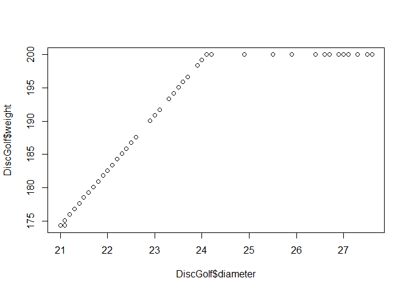

<!-- README.md is generated from README.Rmd. Please edit that file -->

# DiscGolf

<!-- badges: start -->

<!-- badges: end -->

The goal of DiscGolf is to let people know about approved disks,

## Installation

You can install the released version of DiscGolf from
[CRAN](https://CRAN.R-project.org) with:

``` r
install.packages("DiscGolf")
```

## Example

This is a basic example which shows you how to solve a common problem:

``` r
library(DiscGolf)
## basic example code
```

What is special about using `README.Rmd` instead of just `README.md`?
You can include R chunks like so:

``` r
summary(DiscGolf)
#>  approved_date           class              diameter      flexibility   
#>  Min.   :1964-01-01   Length:1260        Min.   :21.00   Min.   : 0.56  
#>  1st Qu.:2006-04-12   Class :character   1st Qu.:21.10   1st Qu.: 7.37  
#>  Median :2013-07-06   Mode  :character   Median :21.20   Median : 8.96  
#>  Mean   :2009-10-08                      Mean   :21.46   Mean   : 8.76  
#>  3rd Qu.:2017-03-23                      3rd Qu.:21.50   3rd Qu.:10.66  
#>  Max.   :2020-10-03                      Max.   :27.60   Max.   :12.27  
#>                                                          NA's   :2      
#>      height      manufacturer          model             rim_depth    
#>  Min.   :1.300   Length:1260        Length:1260        Min.   :1.100  
#>  1st Qu.:1.700   Class :character   Class :character   1st Qu.:1.100  
#>  Median :1.800   Mode  :character   Mode  :character   Median :1.200  
#>  Mean   :1.893                                         Mean   :1.285  
#>  3rd Qu.:2.000                                         3rd Qu.:1.400  
#>  Max.   :3.800                                         Max.   :2.800  
#>                                                                       
#>  rim_thickness      weight     
#>  Min.   :0.30   Min.   :174.3  
#>  1st Qu.:1.20   1st Qu.:175.1  
#>  Median :1.60   Median :176.0  
#>  Mean   :1.59   Mean   :177.7  
#>  3rd Qu.:2.00   3rd Qu.:178.5  
#>  Max.   :2.60   Max.   :200.0  
#>  NA's   :1
```

You’ll still need to render `README.Rmd` regularly, to keep `README.md`
up-to-date.

You can also embed plots, for example:



In that case, don’t forget to commit and push the resulting figure
files, so they display on GitHub\!
